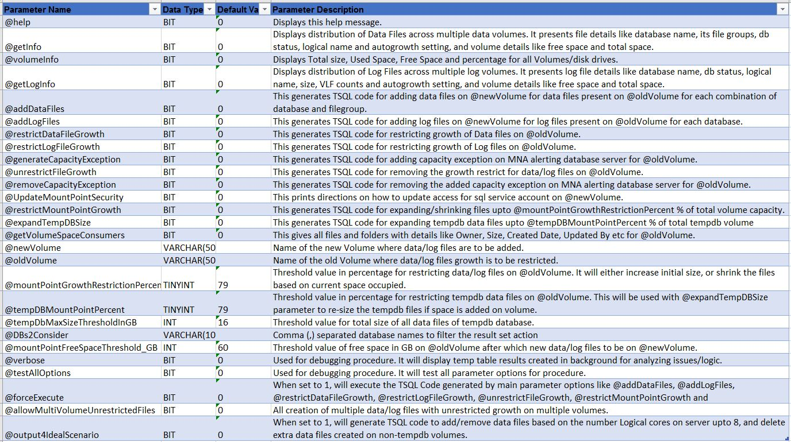

# Space-Capacity-Automation

### General Info
This automation has been designed to eliminate manual efforts on Space Capacity ESC tickets where DBA has to add new data or log files on new volume, and restrict data or log files on old volume. Apart from this, this procedure can be used for variety of tasks related to capacity management. 

For example, say, on server dbTest1774, a new data volume <b>E:\Data1\ </b> has been added. So, DBA has to add new data files on <b>@newVolume</b> (E:\Data1\) and restrict data files on <b>@oldVolume</b> (E:\Data\). This can be accomplished by below methods:-  
<i>EXEC [dbo].[usp_AnalyzeSpaceCapacity] @addDataFiles = 1 ,@newVolume = 'E:\Data1\' ,@oldVolume = 'E:\Data\';</i>  
This generates TSQL code for adding data files on <b>@newVolume</b> for data files present on <b>@oldVolume</b> for each combination of database and filegroup.  
In case, we don’t want TSQL code generation, rather wish to execute it right away, we can execute procedure with @forceExecute parameter.  
<i>EXEC [dbo].[usp_AnalyzeSpaceCapacity] @addDataFiles = 1 ,@newVolume = 'E:\Data1\' ,@oldVolume = 'E:\Data\' ,@forceExecute = 1;</i>

Similarly the procedure [dbo].[usp_AnalyzeSpaceCapacity] can be used for multiple activities related to space capacity.

### Find Help (@help)
The parameter provides directions on how to use this procedure. It also presents 12 examples in it.
 
<i>exec dbo.[usp_AnalyzeSpaceCapacity] @help = 1</i>

Also, below are the parameters for procedure with default values:- 

For best result, always take out help from procedure using @help parameter. Below are few examples in Messages tab:-

### Analyze Data Files Distribution (@getInfo)

This parameter is used to display distribution of Data Files across multiple data volumes. It presents file details like database name, its file groups, db status, logical name and auto growth setting, and volume details like free space and total space. 

Below is a sample output:-

### Analyze Log Files Distribution (@getLogInfo)

This parameter is used to display distribution of Log Files across multiple log volumes. It presents file details like database name, db status, logical name, size, auto growth setting and VLF counts, and volume details like free space and total space. 

Below is a sample output:-

